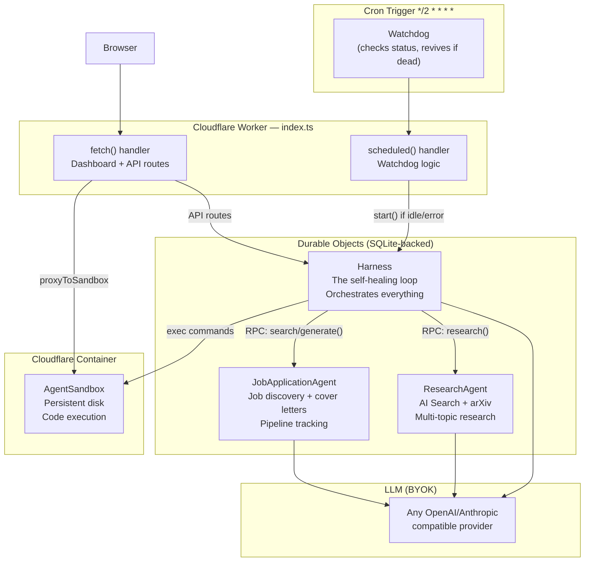

# Self-Starting Agent Harness on Cloudflare

An autonomous, self-healing agent system on Cloudflare that runs on a configurable schedule, persists all context across runs, and delegates work to sub-agents for **research** and **job applications**. Model-agnostic — bring your own API key for any OpenAI/Anthropic-compatible provider.

---

## Design Decisions (Locked In)

| Decision | Choice |
|---|---|
| **Daily goal** | Both research AND job applications in one run |
| **Research topics** | AI/ML, tech stacks, industry/market, competitors, academic papers |
| **Research sources** | Cloudflare AI Search + arXiv API |
| **Job roles** | Software engineering + AI/ML engineering |
| **CV input** | All three: dashboard upload, repo file, API endpoint |
| **Job discovery** | Both manual add + agent auto-discovers via web search |
| **LLM** | Model-agnostic BYOK via Vercel AI SDK (OpenAI, Anthropic, Groq, etc.) |
| **Schedule** | Configurable from dashboard (stored in SQLite, not hardcoded crons) |
| **Notifications** | Dashboard only |
| **Autonomy** | Fully autonomous — no human approval gates |
| **Dashboard** | Full: status, research feed, job kanban, activity log, controls |
| **Auth** | Shared secret token in env var |
| **Sandbox** | Yes — full container with code execution + persistent disk |
| **Max steps** | 100 per run (configurable from dashboard) |

---

## Architecture



### Self-Healing Flow

1. Cron fires every 2 minutes → `scheduled()` runs
2. Gets Harness DO → calls `getStatus()`
3. **If `"idle"` or `"error"`** → checks if a scheduled run is due (from SQLite schedule config) → calls `start()` if yes
4. **If `"running"`, `"paused"`, or `"done"`** → no-op
5. Harness hibernates between steps → zero cost when idle
6. If loop crashes → self-heals on next cron tick (≤2 min)

### Context Persistence

| Layer | Storage | What survives |
|-------|---------|---------------|
| Harness | SQLite (DO) | Run history, context, schedules, config |
| ResearchAgent | SQLite (DO) | Topics, findings, sources |
| JobApplicationAgent | SQLite (DO) | Profile, listings, cover letters, pipeline |
| Sandbox | Disk persistence | Files, installed packages, scripts |

---

## Prerequisites (Phase 0)

- Cloudflare account with **Workers Paid plan** ($5/mo minimum — needed for Containers)
- Node 20+, Docker Desktop running locally
- An API key for your chosen LLM provider (Anthropic, OpenAI, etc.)
- `npm i -g wrangler` or use `npx wrangler`

### Cloudflare API Token (one-time, manual)

1. Dashboard → My Profile → API Tokens → Create Token
2. Use "Edit Cloudflare Workers" template, scope to your account
3. Save as `CLOUDFLARE_API_TOKEN`

```bash
export CLOUDFLARE_API_TOKEN="..."
export CLOUDFLARE_ACCOUNT_ID="..."   # from dashboard sidebar
```

---

## Proposed Changes

### Project Setup

#### [NEW] [package.json](file:///c:/Users/uyios/Desktop/repos/agent%20on%20cloudflare/package.json)

```json
{
  "name": "agent-harness",
  "private": true,
  "scripts": {
    "dev": "wrangler dev",
    "deploy": "wrangler deploy",
    "tail": "wrangler tail",
    "types": "wrangler types"
  },
  "dependencies": {
    "agents": "latest",
    "ai": "latest",
    "@ai-sdk/anthropic": "latest",
    "@ai-sdk/openai": "latest",
    "@cloudflare/sandbox": "latest",
    "zod": "^3.23.0"
  },
  "devDependencies": {
    "wrangler": "latest",
    "typescript": "^5.5.0",
    "@cloudflare/workers-types": "latest"
  }
}
```

Both `@ai-sdk/anthropic` and `@ai-sdk/openai` installed — user switches providers by changing a config value + API key, no code change needed.

#### [NEW] [tsconfig.json](file:///c:/Users/uyios/Desktop/repos/agent%20on%20cloudflare/tsconfig.json)
ES2022 target, Cloudflare Workers types, strict mode.

#### [NEW] [.gitignore](file:///c:/Users/uyios/Desktop/repos/agent%20on%20cloudflare/.gitignore)
Node modules, `.dev.vars`, `.wrangler/`, `dist/`.

#### [NEW] [.dev.vars](file:///c:/Users/uyios/Desktop/repos/agent%20on%20cloudflare/.dev.vars)
```env
LLM_API_KEY=sk-...
LLM_PROVIDER=anthropic
LLM_MODEL=claude-sonnet-4-20250514
DASHBOARD_TOKEN=your-secret-token-here
```

---

### Cloudflare Configuration

#### [NEW] [wrangler.jsonc](file:///c:/Users/uyios/Desktop/repos/agent%20on%20cloudflare/wrangler.jsonc)

```jsonc
{
  "name": "agent-harness",
  "main": "src/index.ts",
  "compatibility_date": "2026-07-01",
  "compatibility_flags": ["nodejs_compat"],

  "vars": {
    "MAX_STEPS": "100",
    "LLM_PROVIDER": "anthropic",
    "LLM_MODEL": "claude-sonnet-4-20250514"
  },

  "durable_objects": {
    "bindings": [
      { "name": "HARNESS", "class_name": "Harness" },
      { "name": "RESEARCH_AGENT", "class_name": "ResearchAgent" },
      { "name": "JOB_AGENT", "class_name": "JobApplicationAgent" },
      { "name": "SANDBOX", "class_name": "AgentSandbox" }
    ]
  },

  "containers": [
    {
      "class_name": "AgentSandbox",
      "image": "./Dockerfile",
      "max_instances": 3
    }
  ],

  "migrations": [
    { "tag": "v1", "new_sqlite_classes": ["Harness", "ResearchAgent", "JobApplicationAgent"] },
    { "tag": "v2", "new_classes": ["AgentSandbox"] }
  ],

  "triggers": {
    "crons": ["*/2 * * * *"]
  }
}
```

> [!NOTE]
> The `*/2 * * * *` cron is the **watchdog** only. It does NOT define when the agent runs its tasks. Task schedules are stored in SQLite and managed from the dashboard — the watchdog just checks if a scheduled run is due and the harness isn't already running.

#### [NEW] [Dockerfile](file:///c:/Users/uyios/Desktop/repos/agent%20on%20cloudflare/Dockerfile)
```dockerfile
FROM docker.io/cloudflare/sandbox:0.8.9
# Base image: node, python, bun, npm, git
```

---

### Core Application Code (`src/`)

#### [NEW] [src/types.ts](file:///c:/Users/uyios/Desktop/repos/agent%20on%20cloudflare/src/types.ts)

All shared TypeScript types:

```typescript
// Env bindings
interface Env {
  HARNESS: DurableObjectNamespace;
  RESEARCH_AGENT: DurableObjectNamespace;
  JOB_AGENT: DurableObjectNamespace;
  SANDBOX: DurableObjectNamespace;
  LLM_API_KEY: string;
  LLM_PROVIDER: string;    // "anthropic" | "openai" | "groq"
  LLM_MODEL: string;       // e.g. "claude-sonnet-4-20250514"
  MAX_STEPS: string;
  DASHBOARD_TOKEN: string;
}

// Harness state
interface HarnessState {
  status: "idle" | "running" | "paused" | "done" | "error";
  currentStep: number;
  maxSteps: number;
  goal: string;
  lastRunAt: string | null;
  lastError: string | null;
}

// Schedule entry (stored in SQLite, managed from dashboard)
interface ScheduleEntry {
  id: number;
  cron: string;           // e.g. "0 8 * * *"
  focus: string;          // "all" | "research" | "jobs"
  enabled: boolean;
  lastTriggeredAt: string | null;
}

// Research + Job domain types
interface ResearchResult { ... }
interface JobListing { ... }
interface CoverLetter { ... }
```

---

#### [NEW] [src/llm.ts](file:///c:/Users/uyios/Desktop/repos/agent%20on%20cloudflare/src/llm.ts)

**Model-agnostic LLM factory.** Reads `LLM_PROVIDER` and `LLM_MODEL` from env and returns the correct Vercel AI SDK model instance:

```typescript
import { anthropic } from "@ai-sdk/anthropic";
import { openai } from "@ai-sdk/openai";

export function getModel(env: Env) {
  switch (env.LLM_PROVIDER) {
    case "anthropic":
      return anthropic(env.LLM_MODEL, { apiKey: env.LLM_API_KEY });
    case "openai":
      return openai(env.LLM_MODEL, { apiKey: env.LLM_API_KEY });
    default:
      throw new Error(`Unknown provider: ${env.LLM_PROVIDER}`);
  }
}
```

Any agent imports `getModel(this.env)` — switching providers is just changing two env vars.

---

#### [NEW] [src/sandbox.ts](file:///c:/Users/uyios/Desktop/repos/agent%20on%20cloudflare/src/sandbox.ts)

Container-backed DO with persistent disk:

```typescript
import { Sandbox } from "@cloudflare/sandbox";

export class AgentSandbox extends Sandbox {
  sleepAfter = "10m";
  persistAcrossSessions = { type: "disk" };
}
```

---

#### [NEW] [src/harness.ts](file:///c:/Users/uyios/Desktop/repos/agent%20on%20cloudflare/src/harness.ts)

**The brain — self-healing orchestration loop.**

`@callable()` lifecycle methods:
- `start(goal?)` — begin a run (loads context, calls LLM in a tool loop)
- `pause()` / `resume()` / `stop()` — control the loop
- `getStatus()` — returns current state (used by watchdog)
- `getConfig()` — returns schedules, maxSteps, goal, provider info
- `updateConfig(config)` — update settings from dashboard
- `addSchedule(cron, focus)` / `removeSchedule(id)` — manage run schedules
- `getLog(limit)` — return recent step log entries
- `getDailySummaries(limit)` — return recent daily summaries

SQLite tables:
```sql
-- Persistent key-value context (cross-run memory)
CREATE TABLE IF NOT EXISTS context (
  key TEXT PRIMARY KEY,
  value TEXT NOT NULL,
  updated_at TEXT DEFAULT (datetime('now'))
);

-- Step-by-step activity log
CREATE TABLE IF NOT EXISTS step_log (
  id INTEGER PRIMARY KEY AUTOINCREMENT,
  run_id TEXT,
  step_number INTEGER,
  action TEXT,
  input TEXT,
  output TEXT,
  agent TEXT,
  tokens_used INTEGER,
  created_at TEXT DEFAULT (datetime('now'))
);

-- Daily run summaries (long-term memory)
CREATE TABLE IF NOT EXISTS daily_summaries (
  id INTEGER PRIMARY KEY AUTOINCREMENT,
  run_id TEXT,
  date TEXT,
  goal TEXT,
  focus TEXT,
  summary TEXT,
  decisions TEXT,
  steps_taken INTEGER,
  created_at TEXT DEFAULT (datetime('now'))
);

-- Configurable schedules (managed from dashboard)
CREATE TABLE IF NOT EXISTS schedules (
  id INTEGER PRIMARY KEY AUTOINCREMENT,
  cron TEXT NOT NULL,
  focus TEXT DEFAULT 'all',
  enabled INTEGER DEFAULT 1,
  last_triggered_at TEXT
);

-- Agent config (model, maxSteps, goal, etc.)
CREATE TABLE IF NOT EXISTS config (
  key TEXT PRIMARY KEY,
  value TEXT NOT NULL
);
```

LLM tools (via Vercel AI SDK `tool()`):
| Tool | Description |
|------|-------------|
| `delegate_research` | Send topic to ResearchAgent, get findings back |
| `delegate_job_search` | Send criteria to JobAgent, get listings/drafts back |
| `delegate_job_cover_letter` | Ask JobAgent to generate a cover letter for a specific listing |
| `get_job_pipeline` | Get full pipeline status from JobAgent |
| `save_context` | Persist a key-value pair for future runs |
| `get_context` | Retrieve persisted context |
| `run_in_sandbox` | Execute a shell command in the container |
| `write_file_in_sandbox` | Write a file to the persistent container disk |
| `read_file_from_sandbox` | Read a file from the container |
| `finish_run` | Save daily summary, set status to `"done"` |

Typical run flow:
1. Watchdog calls `start()` → status → `"running"`
2. Load yesterday's summary + all context + user profile → build system prompt
3. LLM tool loop (up to 100 steps):
   - `delegate_research({ topic: "AI agent frameworks 2026" })`
   - `delegate_research({ topic: "TypeScript serverless trends" })`
   - `delegate_job_search({ criteria: "senior TypeScript AI engineer" })`
   - `delegate_job_cover_letter({ jobId: 42 })`
   - `save_context({ key: "latest_findings", value: "..." })`
   - `finish_run({ summary: "Researched 3 topics, found 2 new listings, generated 1 cover letter" })`
4. Status → `"done"`, harness hibernates

---

#### [NEW] [src/research-agent.ts](file:///c:/Users/uyios/Desktop/repos/agent%20on%20cloudflare/src/research-agent.ts)

**Sub-agent for multi-topic research.** Spawned by Harness via DO RPC.

`@callable()` methods:
- `research({ topic, depth })` — run a research task using AI Search + arXiv
- `getHistory({ topic })` — previous research on this topic
- `getTopics()` — list all tracked topics
- `getRecentFindings(limit)` — latest results across all topics

Research tools (internal to this agent's LLM loop):
- `web_search` — Cloudflare AI Search (no API key needed)
- `search_arxiv` — query arXiv API for papers by topic/keyword
- `save_finding` — persist a research finding to SQLite
- `summarize` — synthesize multiple findings into a brief

SQLite tables:
```sql
CREATE TABLE IF NOT EXISTS research_results (
  id INTEGER PRIMARY KEY AUTOINCREMENT,
  topic TEXT NOT NULL,
  query TEXT,
  summary TEXT NOT NULL,
  sources TEXT,           -- JSON array
  depth TEXT DEFAULT 'standard',
  created_at TEXT DEFAULT (datetime('now'))
);

CREATE TABLE IF NOT EXISTS research_topics (
  id INTEGER PRIMARY KEY AUTOINCREMENT,
  topic TEXT UNIQUE NOT NULL,
  priority INTEGER DEFAULT 5,
  times_researched INTEGER DEFAULT 0,
  last_researched TEXT,
  status TEXT DEFAULT 'active'
);
```

---

#### [NEW] [src/job-agent.ts](file:///c:/Users/uyios/Desktop/repos/agent%20on%20cloudflare/src/job-agent.ts)

**Sub-agent for job discovery, cover letters, and pipeline tracking.**

`@callable()` methods:
- `setProfile({ cv, preferences })` — store/update user profile
- `getProfile()` — return current profile
- `searchJobs({ criteria })` — discover jobs via web search, return matches
- `addJob({ company, title, description, url })` — manually add a listing
- `generateCoverLetter({ jobId })` — generate tailored cover letter using profile
- `updateStatus({ jobId, status, notes })` — move through pipeline
- `getPipeline()` — full pipeline with all listings grouped by status
- `getDueFollowUps()` — follow-ups due today/overdue
- `addFollowUp({ jobId, dueDate, note })` — schedule a follow-up
- `getStats()` — counts by status, recent activity

Job tools (internal to this agent's LLM loop):
- `search_jobs_web` — Cloudflare AI Search with job-focused queries
- `analyze_listing` — extract key requirements from a job description
- `match_profile` — compare listing requirements against user profile
- `draft_cover_letter` — generate a cover letter draft
- `save_job` / `save_cover_letter` — persist to SQLite

SQLite tables:
```sql
CREATE TABLE IF NOT EXISTS user_profile (
  key TEXT PRIMARY KEY,
  value TEXT NOT NULL,
  updated_at TEXT DEFAULT (datetime('now'))
);

CREATE TABLE IF NOT EXISTS job_listings (
  id INTEGER PRIMARY KEY AUTOINCREMENT,
  company TEXT NOT NULL,
  title TEXT NOT NULL,
  description TEXT,
  url TEXT,
  match_score REAL,       -- 0-1, how well it matches profile
  status TEXT DEFAULT 'discovered',  -- discovered|draft|applied|interview|offer|rejected
  priority INTEGER DEFAULT 5,
  notes TEXT,
  source TEXT DEFAULT 'manual',      -- 'manual' | 'auto-discovered'
  created_at TEXT DEFAULT (datetime('now')),
  updated_at TEXT DEFAULT (datetime('now'))
);

CREATE TABLE IF NOT EXISTS cover_letters (
  id INTEGER PRIMARY KEY AUTOINCREMENT,
  job_id INTEGER REFERENCES job_listings(id),
  version INTEGER DEFAULT 1,
  content TEXT NOT NULL,
  created_at TEXT DEFAULT (datetime('now'))
);

CREATE TABLE IF NOT EXISTS follow_ups (
  id INTEGER PRIMARY KEY AUTOINCREMENT,
  job_id INTEGER REFERENCES job_listings(id),
  due_date TEXT NOT NULL,
  note TEXT,
  completed INTEGER DEFAULT 0
);
```

---

#### [NEW] [src/index.ts](file:///c:/Users/uyios/Desktop/repos/agent%20on%20cloudflare/src/index.ts)

**Worker entry point.** Three responsibilities:

**1. `fetch()` — HTTP routing with auth:**

All `/api/*` routes check `Authorization: Bearer <DASHBOARD_TOKEN>`. The dashboard HTML is public (it prompts for the token client-side).

| Route | Method | Description |
|-------|--------|-------------|
| `/` | GET | Serve dashboard HTML |
| `/api/status` | GET | Harness status + last run summary |
| `/api/config` | GET/PUT | Get or update harness config (goal, maxSteps, model) |
| `/api/schedules` | GET/POST/DELETE | Manage run schedules |
| `/api/log` | GET | Recent step log |
| `/api/summaries` | GET | Daily run summaries |
| `/api/research` | GET | Research topics and findings |
| `/api/pipeline` | GET | Job application pipeline |
| `/api/jobs` | POST | Add a job listing |
| `/api/jobs/:id/cover-letter` | POST | Generate cover letter |
| `/api/jobs/:id/status` | PUT | Update job status |
| `/api/profile` | GET/PUT | Get or update CV/profile |
| `/api/start` | POST | Manually trigger a run |
| `/api/stop` | POST | Stop the current run |

**2. `scheduled()` — Watchdog:**

```typescript
async scheduled(event, env) {
  const harness = getAgentByName(env.HARNESS, "main");
  const status = await harness.getStatus();

  if (status === "idle" || status === "error") {
    // Check if any enabled schedule is due
    const isDue = await harness.checkSchedulesDue();
    if (isDue) {
      await harness.start();
    }
  }
}
```

**3. Exports:** `Harness`, `ResearchAgent`, `JobApplicationAgent`, `AgentSandbox`

---

#### [NEW] [src/dashboard.ts](file:///c:/Users/uyios/Desktop/repos/agent%20on%20cloudflare/src/dashboard.ts)

**Full self-contained HTML dashboard** (no build step, served inline).

Sections:
1. **Header** — agent name, status badge (idle/running/done/error), model provider, auth token input
2. **Status panel** — current step / max steps progress bar, goal, last run time, next scheduled run
3. **Controls** — Start Now / Stop / Pause buttons, edit goal, edit maxSteps, switch model provider
4. **Schedule manager** — add/remove cron schedules with focus (all/research/jobs), toggle enabled
5. **Research feed** — topics list with last-researched date, expandable findings with sources
6. **Job pipeline kanban** — columns: Discovered → Draft → Applied → Interview → Offer, cards with company/title/match score, click to view cover letter, drag to change status
7. **Profile section** — paste or upload CV, edit job preferences
8. **Activity log** — scrollable table of recent steps with timestamp, agent, action, truncated output

Design:
- Dark mode default, glassmorphism cards, smooth transitions
- CSS Grid layout, fully responsive
- Vanilla JS, fetches from `/api/*` with Bearer token
- Auto-refreshes status every 10 seconds when a run is active
- Color palette: slate backgrounds, emerald accents for success, amber for warnings

---

### Provisioning & DevOps

#### [NEW] [scripts/setup.sh](file:///c:/Users/uyios/Desktop/repos/agent%20on%20cloudflare/scripts/setup.sh)

```bash
#!/usr/bin/env bash
set -euo pipefail
: "${CLOUDFLARE_API_TOKEN:?}"
: "${CLOUDFLARE_ACCOUNT_ID:?}"
: "${LLM_API_KEY:?}"
: "${DASHBOARD_TOKEN:?}"

npm install
echo "$LLM_API_KEY" | npx wrangler secret put LLM_API_KEY
echo "$DASHBOARD_TOKEN" | npx wrangler secret put DASHBOARD_TOKEN
npx wrangler deploy

echo "Deployed. Watchdog starts within 2 minutes."
```

#### [NEW] [.github/workflows/deploy.yml](file:///c:/Users/uyios/Desktop/repos/agent%20on%20cloudflare/.github/workflows/deploy.yml)

Auto-deploy on push to `main` via `cloudflare/wrangler-action@v3`.

---

## File Tree

```
agent on cloudflare/
├── wrangler.jsonc
├── Dockerfile
├── package.json
├── tsconfig.json
├── .gitignore
├── .dev.vars                    # gitignored
├── scripts/
│   └── setup.sh
├── .github/
│   └── workflows/
│       └── deploy.yml
└── src/
    ├── index.ts                 # Worker entry: fetch + scheduled watchdog
    ├── types.ts                 # Shared types & Env interface
    ├── llm.ts                   # Model-agnostic LLM factory (BYOK)
    ├── harness.ts               # Harness DO: self-healing orchestration loop
    ├── research-agent.ts        # ResearchAgent DO: AI Search + arXiv
    ├── job-agent.ts             # JobApplicationAgent DO: pipeline + cover letters
    ├── sandbox.ts               # AgentSandbox: container with persistent disk
    └── dashboard.ts             # Full HTML dashboard (inline, no build step)
```

---

## Guardrails

| Guardrail | Mechanism |
|-----------|-----------|
| Runaway loop | `maxSteps = 100` (configurable from dashboard) |
| Token burn | Provider-side spend cap + step limit |
| Container sprawl | `max_instances: 3` in wrangler.jsonc |
| Crash recovery | Cron watchdog revives within ≤2 min |
| Data loss | SQLite in DOs + disk persistence in Sandbox |
| Unauthorized access | `DASHBOARD_TOKEN` on all API routes |
| Model lock-in | Vercel AI SDK abstracts provider, switch via env var |

---

## Verification Plan

### Local Dev
```bash
npx wrangler dev
# Trigger watchdog manually:
curl "http://localhost:8787/__scheduled?cron=*/2+*+*+*+*"
# Check status:
curl -H "Authorization: Bearer YOUR_TOKEN" http://localhost:8787/api/status
```

### Post-Deploy
```bash
npx wrangler deploy
npx wrangler tail
npx wrangler tail --status error
```

### Manual Checks
1. Dashboard loads → status shows `"idle"`, schedule manager visible
2. Add a schedule via dashboard → stored in SQLite
3. Cron fires → watchdog checks schedule → starts run if due
4. Harness delegates to ResearchAgent → step log shows delegation + results
5. Harness delegates to JobAgent → pipeline shows new listings
6. Add job manually via dashboard → cover letter generated
7. Kill DO manually → cron revives within 2 minutes
8. Change LLM provider via dashboard → next run uses new provider
9. Redeploy → all SQLite data survives
